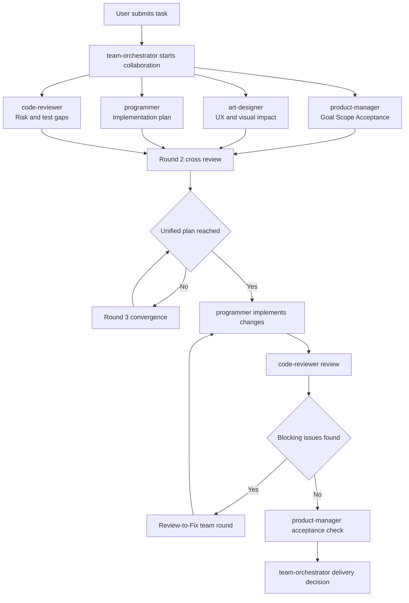

# Multi-Agent Prompt Collaboration System


[中文](README.md) | [English](README.en.md)

A multi-role prompt template repository for VS Code + GitHub Copilot Chat.

This repo defines 4 specialist roles plus 1 orchestrator role to build a closed loop across requirement analysis, design impact evaluation, implementation, and code review, reducing rework and risk from single-role decision making.

## Table of Contents

- [Why This Repo](#why-this-repo)
- [Key Highlights](#key-highlights)
- [Roles](#roles)
- [Repository Structure](#repository-structure)
- [Default Workflow](#default-workflow)
- [Collaboration Flow Diagram](#collaboration-flow-diagram)
- [30-Second Quick Start](#30-second-quick-start)
- [Deployment](#deployment)
- [Usage Tips](#usage-tips)
- [Expected Output Checklist](#expected-output-checklist)
- [Compatibility](#compatibility)
- [FAQ](#faq)
- [License](#license)

## Why This Repo

- Keeps every task aligned across product, design, engineering, and review perspectives
- Enforces a stable workflow for complex changes and reduces missed steps
- Converts code review findings into a trackable fix loop
- Produces delivery evidence with risk notes, test scope, and impact analysis

## Key Highlights

### 1. Enforced collaboration

All four roles participate by default. No single role should close the task independently.

### 2. Review with fix closure

When blockers are found, the process enters a Review-to-Fix round with discussion, implementation, and re-check.

### 3. Delivery-ready outputs

Outputs are traceable to role inputs, decisions, implementation impact, and validation scope.

## Roles

- product-manager: requirements, scope, acceptance criteria
- art-designer: visual and interaction impact
- programmer: implementation, fixes, tests
- code-reviewer: risk analysis, regression checks, testing gaps
- team-orchestrator: cross-role coordination and conflict convergence

## Repository Structure

```text
.
├─ AGENTS.md
├─ copilot-instructions.md
└─ agents/
   ├─ team-orchestrator.agent.md
   ├─ programmer.agent.md
   ├─ code-reviewer.agent.md
   ├─ product-manager.agent.md
   └─ art-designer.agent.md
```

## Default Workflow

1. Collect initial input from all four roles in parallel
2. Run cross-review and resolve conflicts
3. Execute implementation only after a unified plan is agreed
4. If review finds blockers, enter Review-to-Fix collaboration
5. Re-validate with code-reviewer + product-manager
6. Final delivery decision by team-orchestrator

## Collaboration Flow Diagram



## 30-Second Quick Start

Send this in Copilot Chat:

```text
按.github里规则：帮我把登录页的错误提示改成可配置文案，并补齐回归测试。
```

You should then see parallel role input, cross-review, implementation, and validation closure.

## Deployment

### Option A: Repository-level setup (recommended for teams)

Use this when your team needs a shared collaboration workflow in the same repository.

1. Clone this repository locally (or copy files into your project)
2. Keep these files at the repository root:
   - AGENTS.md
   - copilot-instructions.md
   - agents/*.agent.md
3. Open the project in VS Code
4. Ensure GitHub Copilot and Copilot Chat are installed and signed in
5. Start tasks in Copilot Chat

### Option B: Integrate into an existing repository

Use this when you already have a business/project repo and only want this multi-agent workflow.

1. Copy the following into your target repository root:
   - AGENTS.md
   - copilot-instructions.md
   - agents/ directory
2. Commit and let your team pull the latest changes
3. Use Copilot Chat directly in the target repo

## Usage Tips

- Include goal, scope, constraints, and acceptance criteria in task prompts
- For feature changes, specify before and after behavior
- To force the full collaboration mode, include: 按.github里规则
- Route review findings back to team discussion before implementation

## Expected Output Checklist

- Summary from all four roles
- Conflict and decision log
- Change list and impact scope
- Regression test scope and results
- Remaining risks and next steps

## Compatibility

- Dependency: VS Code + GitHub Copilot Chat
- Recommended: environments that support custom prompt and agent files
- If your environment loads custom files differently, adjust file locations per platform docs

## FAQ

### 1) Why do I only get single-role output?

Check:

- Whether all files are present at repository root
- Whether team-orchestrator.agent.md was removed by mistake
- Whether your prompt clearly includes goals and constraints

### 2) Why does the reviewer not edit code directly?

By design, code-reviewer reports issues and recommendations only. Fixes must be discussed in the team loop and implemented by programmer.

### 3) Can I enable only two roles?

Current policy is full collaboration mode. All four roles are expected to participate and provide explicit conclusions, including no-impact reasoning when applicable.

## License

This project is licensed under the MIT License. See [LICENSE](LICENSE).
