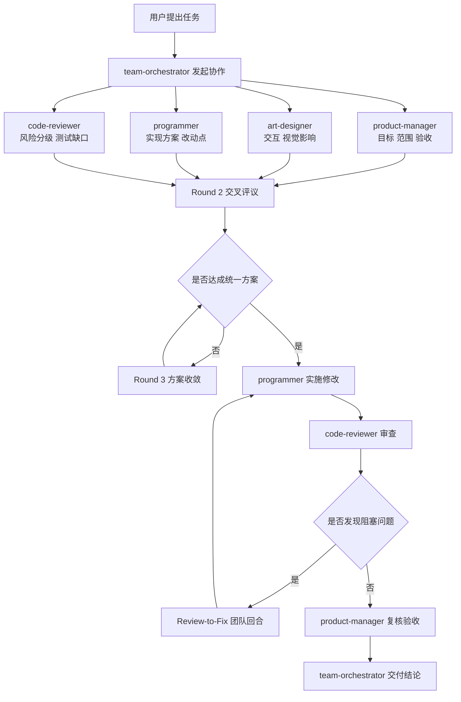

# Multi-Agent 协作提示词系统


[中文](README.md) | [English](README.en.md)

一个面向 VS Code + GitHub Copilot Chat 的多角色协作提示词模板仓库。

该仓库定义了 4 个专业角色 + 1 个总协调角色，用于把需求分析、设计评估、实现落地、代码审查串成闭环，减少单角色决策带来的返工和风险。

## 目录

- [为什么使用](#为什么使用)
- [核心亮点](#核心亮点)
- [角色说明](#角色说明)
- [仓库结构](#仓库结构)
- [工作机制默认](#工作机制默认)
- [协作流程图](#协作流程图)
- [30秒快速体验](#30秒快速体验)
- [部署方式](#部署方式)
- [使用建议](#使用建议)
- [输出期望建议作为验收清单](#输出期望建议作为验收清单)
- [版本与兼容性](#版本与兼容性)
- [常见问题](#常见问题)
- [License](#license)

## 为什么使用

- 让任务始终经过产品、设计、开发、审查四方视角
- 让复杂改动有固定协作节奏，减少关键步骤遗漏
- 让 Code Review 问题进入可追踪的修复闭环
- 让最终输出具备可交付证据（风险、测试、影响面）

## 核心亮点

### 1. 强制协作，不靠单点判断

默认要求四角色共同参与，任何角色都不能跳过流程单独收口。

### 2. 审查可闭环，不止提问题

发现问题后进入 Review-to-Fix 回合，确保问题有讨论、有实施、有复核。

### 3. 输出可验收，适合团队落地

每次任务产出都能追溯到角色输入、决策依据、改动影响和测试范围。

## 角色说明

- product-manager：拆解需求、范围和验收标准
- art-designer：评估视觉与交互影响
- programmer：实现功能、修复问题、补测试
- code-reviewer：识别风险、评估回归与测试缺口
- team-orchestrator：统一调度四角色并收敛分歧

## 仓库结构

```text
.
├─ AGENTS.md
├─ copilot-instructions.md
└─ agents/
   ├─ team-orchestrator.agent.md
   ├─ programmer.agent.md
   ├─ code-reviewer.agent.md
   ├─ product-manager.agent.md
   └─ art-designer.agent.md
```

## 工作机制默认

1. 并行收集四角色初版意见
2. 交叉评议并收敛冲突
3. 形成统一方案后再实施修改
4. 若审查发现问题，进入 Review-to-Fix 协作回合
5. 修复后由 code-reviewer + product-manager 复核
6. 由 team-orchestrator 给出是否可交付结论

## 协作流程图



## 30秒快速体验

在 Copilot Chat 中直接发送：

```text
按.github里规则：帮我把登录页的错误提示改成可配置文案，并补齐回归测试。
```

你将看到四角色并行输入、交叉评议、实施与复核的完整过程。

## 部署方式

### 方式 A：仓库级部署（推荐，适合团队共享）

适合：希望团队成员在同一项目中共享这套协作规则。

1. 克隆本仓库到本地（或将文件复制到你的项目仓库）
2. 保持以下文件位于项目根目录：
   - AGENTS.md
   - copilot-instructions.md
   - agents/*.agent.md
3. 用 VS Code 打开该项目
4. 确认已安装并登录 GitHub Copilot（含 Chat）
5. 在 Copilot Chat 中发起任务，系统将按规则触发协作流程

### 方式 B：作为模板二次集成（适合已有仓库）

适合：你已有业务仓库，只想引入这套多 Agent 协作机制。

1. 从本仓库复制以下内容到你的目标仓库根目录：
   - AGENTS.md
   - copilot-instructions.md
   - agents/ 整个目录
2. 提交到目标仓库后，团队成员拉取最新代码
3. 在目标仓库中直接使用 Copilot Chat 发起任务

## 使用建议

- 需求描述尽量包含：目标、范围、限制、验收标准
- 功能改动任务建议明确修改前和修改后行为
- 如果你希望强制启用协作流程，在提问中包含按.github里规则
- 让审查问题先回流团队讨论，再实施修复，避免来回返工

## 输出期望建议作为验收清单

每次任务最终产出建议至少包含：

- 四角色输入摘要
- 分歧与决策记录
- 修改清单与影响面
- 回归测试范围与结果
- 未解决风险与下一步

## 版本与兼容性

- 依赖：VS Code + GitHub Copilot Chat
- 建议：在支持自定义提示词和 Agent 文件的环境下使用
- 若你所在环境对自定义文件加载策略不同，请按平台文档调整文件位置

## 常见问题

### 1) 为什么我只看到单角色输出？

先检查：

- 是否在当前项目根目录包含全部文件
- 是否误删了 team-orchestrator.agent.md
- 是否在提问中明确了任务目标和约束

### 2) 审查员为什么不直接改代码？

这是本仓库的强制规则之一：code-reviewer 负责发现问题和建议，不直接落地修改；修复必须经过团队回合，由 programmer 实施。

### 3) 可以只启用其中两个角色吗？

当前规则是全量协作模式：默认要求四角色全部参与并显式给出结论（包括无影响 + 理由）。

## License

本项目使用 MIT License，详见 [LICENSE](LICENSE)。
